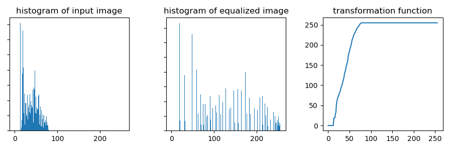

# Test Section

## Test Subsection

### Test Subsubsection

Hello, world!

# Bold and Italic

Test **bold words**. Test *italic words*. Test ***bold and italic words***. 

# Math

Test inline math: $\forall g \in G$.

Test block math:

$$
y = \sum_{i=1}^{N} a_i x^i
$$

# Embedded \LaTeX

Test inline latex things: hi \LaTeX

# Lists

Test number list:

1. Number One
2. Number Two
    1. Subnumber 1
    2. Subnumber 2
    3. Subnumber 3
3. Number Three

Test unordered list:

* Item A
* Item B
    * Subnumber X
    * Subnumber Y
    * Subnumber Z
* Item C

# Code

Test inline code: `print` is a function of `Python`.

Test code section:

```python
print('Hi')
```

# Citation

Test citation: \cite{citation1}

# Image 

Test normal image \ref{fig:first}.


Test normal image \ref{fig:second}.



> width: 1.2in
> 
> caption: Notice we change the width.
> This is the caption sentence for this image.
> There is some math $y=\sin x^2$, and some \LaTeX commands.
> 


# Table

Following is a markdown table: \ref{tab:markdown}.

| A               | B             | C              |
| --------------- | ------------- | -------------- |
| 1               | 222           | 33333          |
| $y=x^2$         | $z^2=x^2+y^2$ | hi             |
| aaa\|\|\|escape | nnnnnnn       | \LaTeX command |

> caption: Hello this is caption.
>
> label: tab:markdown

Following is a latex table: \ref{tab:latex}.

\begin{table}
\caption{An Example of a Table by pure latex}
\label{tab:latex}
\begin{center}
\begin{tabular}{|c||c|}
\hline
Firstly & Hello, world! \\
\hline
Secondly & $1.23 \pm 0.01$ is the answer \\
\hline
\end{tabular}
\end{center}
\end{table}

# Labeling Section {#sec:labeling}

Test label and immediate reference: \ref{sec:labeling}.
However, since the section is unnumbered, this will not show anything.

# Chinese Test

中文测试。